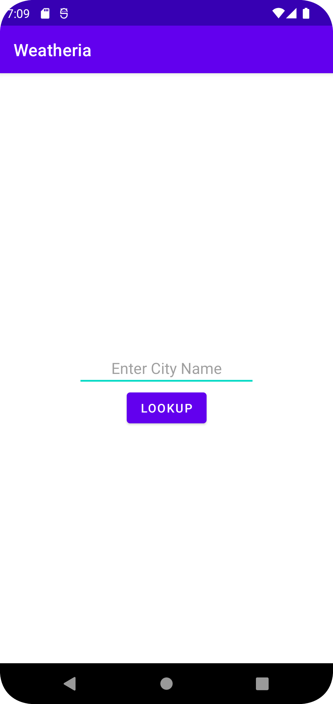
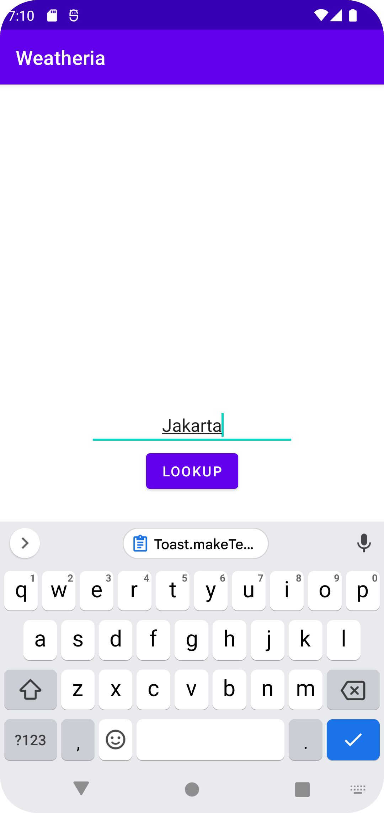
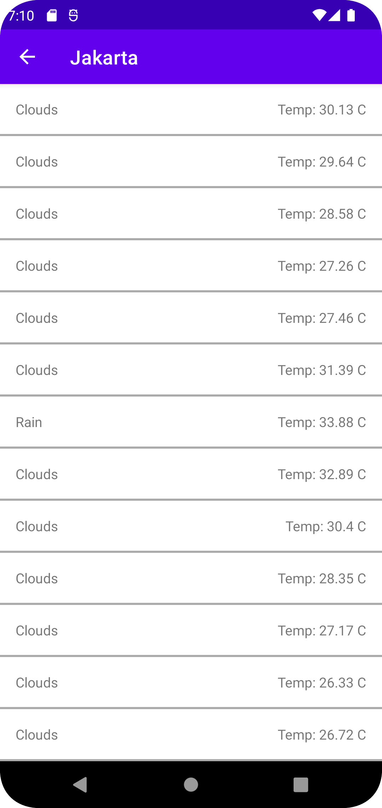
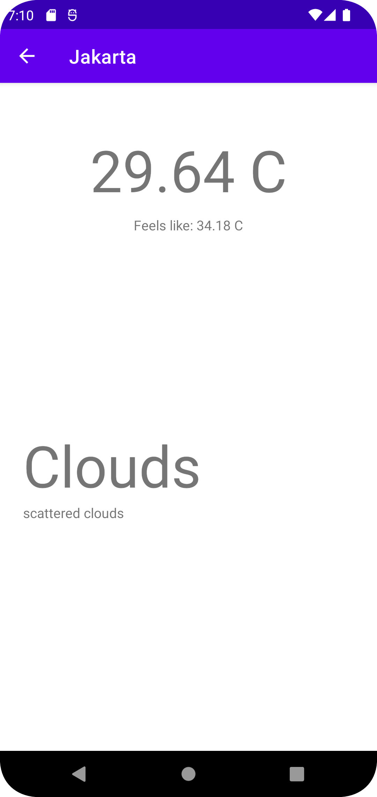
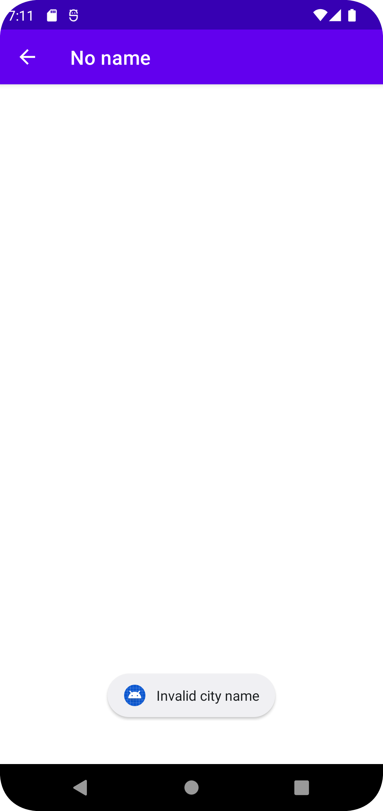

# WeatherApp Android

This is a sample app using Java for interview purposes.

### Libraries

- GSON for parsing
- Volley for api request

### Screenshots

- Default

- Default with City

- Weather list

- Weather detail

- Invalid City
